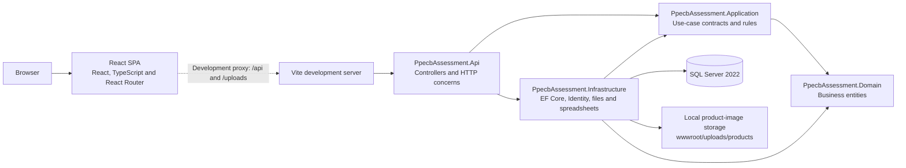

# Architecture

## Overview

The application is a React single-page application backed by an ASP.NET Core Web API and SQL Server. The API is composed from a layered .NET solution; production dependencies point towards the domain.

## UML component diagram

## Layer responsibilities

| Layer | Responsibility | Project dependencies |
| --- | --- | --- |
| Domain | Product, Category and ProductCodeSequence entities | None |
| Application | Use-case contracts, service results and product-code generation | Domain |
| Infrastructure | EF Core persistence, SQL Server, Identity, local image storage and spreadsheet exchange | Application, Domain |
| Api | Controllers, validation, authentication composition, anti-forgery and HTTP responses | Application, Infrastructure |
| Tests | xUnit tests for observable behaviour and API boundaries | Projects under test |

`PpecbAssessment.Api` is the composition root. It registers the API and infrastructure services through dependency injection, configures exception handling, static-file serving, authentication and authorization, then maps controllers.

## Request flow

The React application exposes public `/login` and `/register` routes and authenticated `/categories` and `/products` routes. Feature API modules use a shared client at `/api`.

In development, Vite proxies `/api` and `/uploads` to `http://localhost:5080`. The API authenticates the request, validates anti-forgery tokens for unsafe methods, delegates to an application service, then returns an HTTP response or problem-details error. Product and category queries are scoped to the authenticated user.

## Security and data integrity

- ASP.NET Core Identity provides an HttpOnly, SameSite=Strict cookie session. Secure cookies are required outside the Development environment.
- Unsafe requests require an anti-forgery token obtained from `GET /api/auth/csrf` and sent in the `X-CSRF-TOKEN` header.
- SQL Server constraints enforce category-code format, product-code format, unique business keys and non-negative prices.
- `rowversion` values protect category and product edits from silent overwrites.
- The product-code sequence uses SQL Server locking to allocate globally unique `yyyyMM-###` values safely under concurrent requests.

## Runtime services

SQL Server is the only local infrastructure container. Docker Compose runs SQL Server 2022 with a named volume so database data survives container recreation. EF Core migrations are applied explicitly with `dotnet ef`; the API does not apply migrations automatically at startup.

Product images are written to `wwwroot/uploads/products` and served by static-file middleware. Runtime uploads are excluded from Git. A deployment that uses more than one API instance would need shared durable storage in place of this local implementation.

## Quality checks

GitHub Actions runs backend restore, formatting verification, Release build and tests, followed by frontend dependency installation, tests, linting and production build. The workflow does not start SQL Server or deploy the application, so it does not require runtime secrets.
