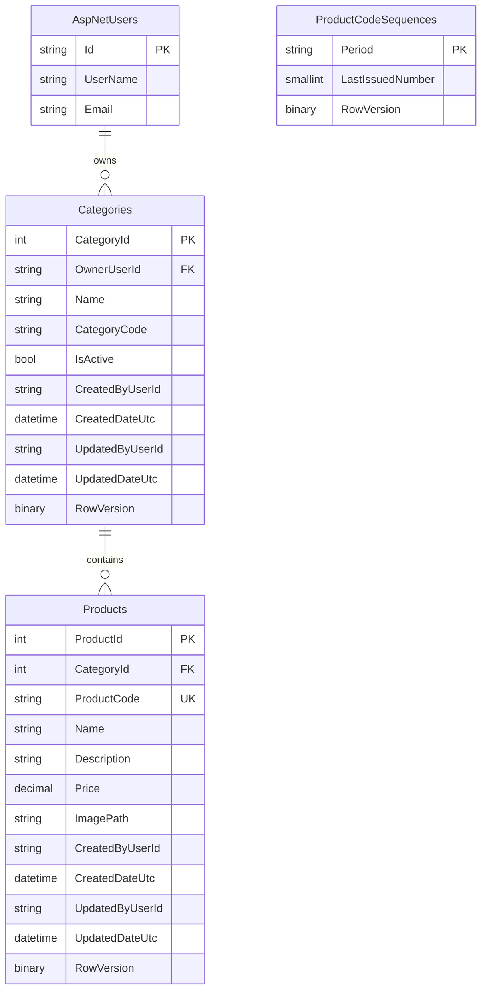

# Data Model

## Entity relationship diagram

`ApplicationUser` is the ASP.NET Core Identity user entity mapped to `AspNetUsers`. Identity also creates its standard support tables for claims, logins, roles and tokens; those tables are omitted here to keep the diagram focused on the product catalogue.

## Relationships

- One user owns many categories through `Categories.OwnerUserId`. User deletion is restricted while categories exist.
- One category contains many products through `Products.CategoryId`. Category deletion is restricted while products exist.
- Products inherit their ownership boundary through their category; `Products` does not store a separate owner identifier.
- `ProductCodeSequences` is independent of `Products`. It allocates monthly product-code numbers and is not a foreign-key relationship.

## Rules and constraints

- `Categories` has a unique `(OwnerUserId, CategoryCode)` index. Category codes are uppercase six-character values in the form `AAA999`.
- `Products.ProductCode` is globally unique and must use the `yyyyMM-###` format.
- Product prices use `decimal(18,2)` and must be non-negative. Descriptions and image paths are optional.
- `ProductCodeSequences.Period` is a valid `yyyyMM` value and `LastIssuedNumber` is limited to 0–999.
- `Categories`, `Products` and `ProductCodeSequences` use SQL Server `rowversion` values as optimistic-concurrency tokens.
- `CreatedByUserId` and `UpdatedByUserId` record audit information. They are not configured as foreign keys; the configured user relationship is `Categories.OwnerUserId`.
